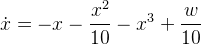
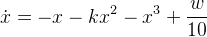

<script type="text/javascript" src="http://cdn.mathjax.org/mathjax/latest/MathJax.js?config=default"></script>

Input-to-State Stability Mapping for Nonlinear Control Systems Using Quantifier Elimination
===========================================================================================

This project contains the *QEPCAD* source files for the test of nonlinear systems regard to *input-to-state stability* (*ISS*). The project allows the verification of the results presented in the follwing paper:

Voßwinkel, R.; Röbenack, K.; Bajcinca, N.:  
*Input-to-State Stability Mapping for Nonlinear Control Systems Using Quantifier Elimination*.  
European Control Conference (ECC), Limassol, Cyprus, June 12-15, 2018, pp. 906-911.

# Prerequisites

You need to install the program *QEPCAD B*, which is a version of *QEPCAD* (*Quantifier Elimination by Partial Cylindrical Algebraic Decomposition*). The package is contained in the repositories of typical Linux distributions. Alternatively, QEPCAD B can be installed from the source code:

https://www.usna.edu/CS/qepcadweb/B/QEPCAD.html

# Example 1

We consider the one-dimensional system  
  
with the state *x* and the input *w*. To test the system regard to ISS we use the Lyapunov candidate function *V*(*x*)=*qx²* with *q*>0.

## Detailed ISS Test without parameters

We use additional comparison functions with the coefficients *p,r,c,d*>0 to ensure that *V* is globally positive definite.

QEPCAD script [iss_ex1a.q](src/iss_ex1a.q):

```qepcad
[ Example 1 without parameters ]
(q,p,r,c,d,x,w)
0
(E q)(E p)(E r)(E c)(E d)(A x)(A w)
[q>0 /\ p>0 /\ r>0 /\ c>0 /\ d>0 /\ 
 p x^2 <= q x^2 /\
 q x^2 <= r x^2 /\
 2 q x (-x-(1/10)x^2-x^3+(1/10)w)<=-d x^2+c w^2].
finish
```

The script yields the result `TRUE`.

## Simplified ISS Test without parameters

A quadratic form with a positive constant or a positive definite matrix, respectively, is always globally positive definite. This allows a simplification of the ISS test:

QEPCAD script [iss_ex1b.q](src/iss_ex1b.q):

```qepcad
[ Example 1 without parameters, simplified ]
(q,c,d,x,w)
0
(E q)(E c)(E d)(A x)(A w)
[q>0 /\ c>0 /\ d>0 /\ 
 2 q x (-x-(1/10)x^2-x^3+(1/10)w)<=-d x^2+c w^2].
finish
```

The script yields the result `TRUE`.


## Simplified ISS Test with parameter *k*

Now we consider the nonlinear systen  
   
with the additional parameter *k* acting as a free variable. We investigate the question, for which parameters *k* the system is ISS.

QEPCAD script [iss_ex1c.q](src/iss_ex1c.q):

```qepcad
[ Example 1 with parameter k (free variable) ]
(k,q,c,d,x,w)
1
(E q)(E c)(E d)(A x)(A w)
[q>0 /\ c>0 /\ d>0 /\ 
 2 q x (-x-k x^2-x^3+(1/10)w)<=-d x^2+c w^2].
finish
```

The script yields the result `k - 2 < 0 /\ k + 2 > 0`. This is an equivalent quntifier-free formula of the prenex formula above. Hence, for -2<*k*<2 the system is ISS.

# Contents

The [src](src) directory contains the source QEPCAD files listed in the next table.

File | Description
:--- | :---
`iss_ex1a.q` | Detailed ISS test without parameters
`iss_ex1b.q` | Simplified ISS test without parameters
`iss_ex1c.q` | Simplified ISS test with the parameter *k* as free variable

# Licence

This project is licensed under the GNU General Public License v3.0 - see the [LICENSE](LICENSE) file for details.
